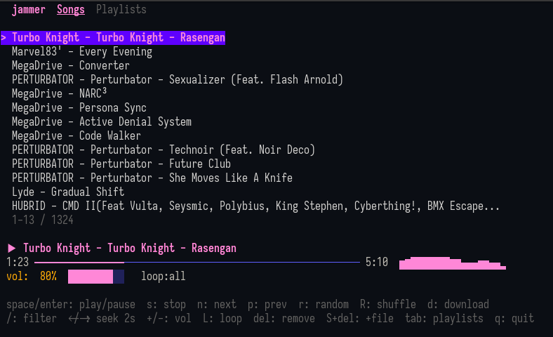

# jammer-go

A terminal music player (TUI) written in Go. Play local files, stream and download tracks from YouTube and SoundCloud on demand, and manage playlists — all from the keyboard.



---

## Features

- Keyboard-driven TUI built with Bubbletea
- On-demand download from YouTube and SoundCloud — no manual `yt-dlp` invocation needed
- Two audio backends: pure-Go **beep** (default, no external libs) or **BASS** (wider format support)
- Playlist browser with `.jammer` (classic and JSONL), M3U and M3U8 support
- Automatic metadata enrichment written back in classic `?|` format
- Per-song download progress shown inline (`[42%]` → `[ok]` / `[err]`)
- Metadata (title/artist) enriched from downloader and embedded file tags, then written back:
  - **MP3** — ID3v2 via `bogem/id3v2`
  - **OGG / OGA** — Vorbis Comment rewriter (custom pure-Go OGG page parser)
  - **FLAC** — Vorbis Comment block patched via `go-flac` + `flacvorbis`
- Audio visualiser (spectrum bars) rendered in the progress bar while playing
- Loop modes: all / off / one — cycle with `L`
- Shuffle mode — toggle with `R`; one-shot random jump with `r`
- Song filter / search with `/`
- Configurable seek step via `settings.json`
- Error bar shown on download failure, auto-cleared after 8 s

---

## Installation

Requires **Go 1.21+**.

```sh
git clone https://github.com/jooapa/jammer
cd jammer/jammer-go
go build -o jammer-go .
```

### Optional runtime dependencies

| Tool | When needed |
|---|---|
| `ffmpeg` | YouTube downloads when the stream is not already OGG/Vorbis |
| `yt-dlp` (or `youtube-dl`) | YouTube playlist URLs; SoundCloud fallback |
| `libbass.so` | Only when BASS backend is selected |

---

## Usage

```sh
./jammer-go                   # Play songs from the songs directory
./jammer-go -p myplaylist     # Load a playlist and start playing immediately
./jammer-go -b                # Use BASS audio backend for this session
./jammer-go -b -p lofi        # BASS backend + playlist
```

### Flags

| Flag | Description |
|---|---|
| `-p <name>` | Load a named playlist from the playlists directory and auto-play on start. Matches by exact filename, with or without extension, or case-insensitive. |
| `-b` | Force BASS backend for this session only (does not persist to `settings.json`). |

---

## Directory layout

jammer-go follows the [XDG Base Directory Specification](https://specifications.freedesktop.org/basedir/latest/).  
**Legacy users:** if `~/jammer/` already exists, it is used for everything (no migration needed).

### XDG layout (new installs)

```
$XDG_DATA_HOME/jammer/          (~/.local/share/jammer/)
├── songs/           # Scanned for local audio files on startup
└── playlists/       # Playlist files (.jammer, .m3u, .m3u8)

$XDG_CONFIG_HOME/jammer/        (~/.config/jammer/)
├── settings.json    # User config
└── KeyData.ini      # Custom keybindings (optional)

$XDG_STATE_HOME/jammer/         (~/.local/state/jammer/)
└── jammer.log       # Debug log (INFO/ERRO/KEY events)

$XDG_CACHE_HOME/jammer/         (~/.cache/jammer/)
└── sc_client_id.json  # Cached SoundCloud client_id (7-day TTL)
```

### Legacy layout (existing `~/jammer/` installs)

```
~/jammer/
├── songs/
├── playlists/
├── settings.json
├── KeyData.ini
├── jammer.log
└── sc_client_id.json
```

Both `songs/` and `playlists/` are created automatically on first launch. The active config location is logged at startup.

---

## settings.json

Full default values — copy this as a starting point:

```json
{
  "backEndType": 0,
  "seekStep": 2,
  "LoopType": 0,
  "defaultView": "",
  "forwardSeconds": 0,
  "rewindSeconds": 0,
  "changeVolumeBy": 0,
  "isAutoSave": false,
  "isMediaButtons": false,
  "isVisualizer": false,
  "clientID": "",
  "modifierKeyHelper": false,
  "isIgnoreErrors": false,
  "showPlaylistPosition": false,
  "rssSkipAfterTime": false,
  "rssSkipAfterTimeValue": 0,
  "EnableQuickSearch": false,
  "favoriteExplainer": false,
  "EnableQuickPlayFromSearch": false,
  "searchResultCount": 0,
  "showTitle": true,
  "titleText": "",
  "titleAnimation": "kitt",
  "titleAnimationSpeed": 0,
  "titleAnimationInterval": 0
}
```

| Field | Type | Default | Description |
|---|---|---|---|
| `backEndType` | int | `0` | Audio backend: `0` = beep (pure Go), `1` = BASS |
| `seekStep` | int | `2` | Fallback seek seconds for `←`/`→` when `forwardSeconds`/`rewindSeconds` are `0` |
| `LoopType` | int | `0` | Initial loop mode: `0` = loop all, `1` = loop off, `2` = loop one |
| `defaultView` | string | `""` | Initial TUI view: `"all"` = full scrollable list, anything else = 3-song snippet |
| `forwardSeconds` | int | `0` | Seconds per forward-seek keypress. `0` defers to `seekStep` |
| `rewindSeconds` | int | `0` | Seconds per rewind keypress. `0` defers to `seekStep` |
| `changeVolumeBy` | float | `0.0` | Persisted/displayed only — volume keys currently hardcode 5%/1% steps |
| `isAutoSave` | bool | `false` | Persisted/displayed only — playlists are always saved on change |
| `isMediaButtons` | bool | `false` | Persisted/displayed only — OS media-button integration not yet implemented |
| `isVisualizer` | bool | `false` | Persisted/displayed only — the visualizer currently always runs |
| `clientID` | string | `""` | SoundCloud client ID — stored for future use, not yet wired to the downloader |
| `modifierKeyHelper` | bool | `false` | Persisted/displayed only — modifier-key hints not yet implemented |
| `isIgnoreErrors` | bool | `false` | Persisted/displayed only — download errors are always skipped |
| `showPlaylistPosition` | bool | `false` | Persisted/displayed only — position display toggling not yet implemented |
| `rssSkipAfterTime` | bool | `false` | Persisted/displayed only — RSS auto-skip not yet implemented |
| `rssSkipAfterTimeValue` | int | `0` | Persisted/displayed only — pairs with `rssSkipAfterTime` (not yet implemented) |
| `EnableQuickSearch` | bool | `false` | Persisted/displayed only — exact-match autoplay from search not yet implemented |
| `favoriteExplainer` | bool | `false` | Persisted/displayed only — favorites confirmation dialog not yet implemented |
| `EnableQuickPlayFromSearch` | bool | `false` | Persisted/displayed only — auto-play first search result not yet implemented |
| `searchResultCount` | int | `0` | Max online search results to return. `0` → `10`; capped at `20` |
| `showTitle` | bool | `false` | Show an animated title banner at the top of the UI |
| `titleText` | string | `""` | Custom title text. `""` → `"Jammer - light-weight CLI music player"`. Requires `showTitle: true` |
| `titleAnimation` | string | `"kitt"` | Title animation type: `kitt`, `rainbow`, `wave`, `typing`, `glitch`, `pulse`, `spotlight`, `border`, `matrix`, `bounce`, or `random`. Requires `showTitle: true` |
| `titleAnimationSpeed` | int | `0` | Milliseconds per animation step. `0` → `80`. Requires `showTitle: true` |
| `titleAnimationInterval` | int | `0` | Milliseconds to pause at the left end before reversing. `0` → `1000`. Requires `showTitle: true` |

Missing or zero values fall back to the defaults listed above. Unknown fields are preserved verbatim. BOM-prefixed UTF-8 files are handled transparently.

---

## Visualizer.ini

Controls the audio spectrum visualizer. Place this file in the jammer data directory (same folder as `settings.json`). If absent, jammer creates it with the defaults below the first time **H** (Load Visualizer) is pressed in the Settings screen.

```ini
[Audio Visualizer]
; Refresh time in milliseconds
RefreshTime = 80
; Frequency range displayed (Hz)
MinFrequency = 80
MaxFrequency = 16000
; Power exponent applied to raw FFT values
LogarithmicMultiplier = 0.45
; Linear amplitude multiplier applied after power scaling
FrequencyMultiplier = 2.5
; Gradually shrink the visualizer when playback is paused
PausingEffect = true
```

| Field | Default | Description |
|---|---|---|
| `RefreshTime` | `100` | Visualizer tick interval in milliseconds |
| `MinFrequency` | `80` | Lowest frequency (Hz) shown on the left edge of the bar display |
| `MaxFrequency` | `16000` | Highest frequency (Hz) shown on the right edge |
| `LogarithmicMultiplier` | `0.45` | Power exponent applied to raw FFT values — lower = more sensitive to quiet sounds |
| `FrequencyMultiplier` | `2.5` | Linear amplitude multiplier — higher = taller bars overall |
| `PausingEffect` | `true` | When `true`, bars decay toward zero while playback is paused |

---

## KeyData.ini

Custom keybindings file. If absent, all defaults below are used. Copy only the bindings you want to change — missing entries keep their defaults.

```ini
[Keybinds]
ToMainMenu = Escape
PlayPause = Spacebar
Quit = Q
NextSong = N
PreviousSong = P
PlaySong = Shift + P
Forward5s = RightArrow
Backwards5s = LeftArrow
VolumeUp = UpArrow
VolumeDown = DownArrow
VolumeUpByOne = Shift + UpArrow
VolumeDownByOne = Shift + DownArrow
Shuffle = S
SaveAsPlaylist = Shift + Alt + S
SaveCurrentPlaylist = Shift + S
ShufflePlaylist = Alt + S
Loop = L
Mute = M
ShowHidePlaylist = F
ListAllPlaylists = Shift + F
Help = H
Settings = C
ToSongStart = 0
ToSongEnd = 9
ToggleInfo = I
SearchInPlaylist = F3
SearchByAuthor = Shift + F3
CurrentState = F12
CommandHelpScreen = Tab
DeleteCurrentSong = Delete
HardDeleteCurrentSong = Shift + Delete
AddSongToPlaylist = Shift + A
AddCurrentSongToFavorites = Ctrl + F
ShowSongsInPlaylists = Shift + D
PlayOtherPlaylist = Shift + O
RedownloadCurrentSong = Shift + B
EditKeybindings = Shift + E
ChangeLanguage = Shift + L
ChangeTheme = Shift + T
PlayRandomSong = R
ChangeSoundFont = Shift + G
GroupMenu = Ctrl + G
AddToGroup = G
PlaylistViewScrollup = PageUp
PlaylistViewScrolldown = PageDown
Choose = Enter
Search = Ctrl + Y
ShowLog = Ctrl + L
ExitRssFeed = E
BackEndChange = B
RenameSong = F2
```

---

## Keybindings

### Songs view

| Key | Action |
|---|---|
| `↑` / `k` | Move cursor up |
| `↓` / `j` | Move cursor down |
| `Space` / `Enter` | Play selected song; pause/resume if it is already playing |
| `s` | Stop playback |
| `n` | Next track |
| `p` | Previous track |
| `→` / `l` | Seek forward by `seekStep` seconds |
| `←` / `h` | Seek backward by `seekStep` seconds |
| `+` / `=` | Volume up 5% |
| `-` | Volume down 5% |
| `r` | Jump to a random song (one-shot, does not change loop/shuffle mode) |
| `R` | Toggle shuffle mode (auto-advance picks a random track each time) |
| `L` | Cycle loop mode: loop all → loop off → loop one |
| `d` | Download the selected song (force re-download even if file exists) |
| `/` | Open filter prompt — type to narrow the song list |
| `Escape` | Clear active filter |
| `Delete` | Remove selected song from the queue (local file kept) |
| `Shift+Delete` | Remove selected song from the queue **and delete the local file** |
| `Tab` | Switch to Playlists view |
| `q` / `Ctrl+C` | Quit |

### Playlists view

| Key | Action |
|---|---|
| `↑` / `k` | Move cursor up |
| `↓` / `j` | Move cursor down |
| `Space` / `Enter` | Load selected playlist |
| `Tab` | Back to Songs view |
| `q` / `Ctrl+C` | Quit |

---

## Playlist format

Playlists are stored in the playlists directory (see [Directory layout](#directory-layout)).

### `.jammer` — Classic format (default)

One line per track using the `?|` delimiter:

```
https://soundcloud.com/artist/track?|{"Title":"Track Name","Author":"Artist"}
https://www.youtube.com/watch?v=XXXX?|{"Title":"Video Title","Author":"Channel"}
https://soundcloud.com/artist/another?|{}
```

Title and author are written back automatically after a successful download. The local resolved path is intentionally not persisted (it may differ between machines).

Files with no metadata can use bare URLs:

```
https://soundcloud.com/artist/track
```

Local file paths are also supported:

```
/path/to/local/file.mp3
```

### `.jammer` — JSONL format (alternative)

One JSON object per line. Detected and loaded automatically:

```jsonl
{"url":"https://soundcloud.com/artist/track","title":"Track Name","author":"Artist"}
{"url":"https://www.youtube.com/watch?v=XXXX","title":"Video Title","author":"Channel"}
{"path":"/absolute/path/to/local/file.mp3"}
```

JSONL files are read-only in the current version. Saved playlists always use the classic format.

### `.m3u` / `.m3u8` — M3U (read-only)

Standard extended M3U. Both URLs and local file paths are supported. Never written back.

---

## Audio backends

### Beep (default)

Pure Go, no external libraries required. Powered by [gopxl/beep](https://github.com/gopxl/beep).

Supported formats: **MP3, OGG Vorbis, WAV, FLAC**

Unsupported formats are skipped silently and the player advances to the next track.

### BASS

Uses the proprietary [BASS audio library](https://www.un4seen.com/) loaded at runtime via `dlopen` (Linux only).

Supported formats: MP3, OGG, WAV, FLAC, AAC, M4A, AIFF, OPUS, WebM, and more.

Requires `libbass.so`. Search order:
1. Same directory as the binary
2. `<binary-dir>/../libs/linux/x86_64/libbass.so`
3. `<cwd>/../libs/linux/x86_64/libbass.so`

Activate with `settings.json` `"backEndType": 1` (persistent) or the `-b` flag (session only).

---

## Download system

Downloads are triggered automatically when a song has a URL but no local file. Press `d` to force a re-download.

| URL type | Method |
|---|---|
| `soundcloud.com` | SoundCloud API v2 with scraped `client_id`; falls back to `yt-dlp` |
| `youtube.com` / `youtu.be` (single video) | [kkdai/youtube](https://github.com/kkdai/youtube); non-OGG streams converted via `ffmpeg` |
| YouTube playlist URLs | Delegated to `yt-dlp` |
| Any other HTTP/HTTPS URL | Generic HTTP download |

Download progress is shown inline next to the song title: `[42%]` → `[ok]` / `[err]`.

After a successful download:
- The local path is updated in the queue
- Title/author are enriched from the downloader metadata or embedded file tags
- Tags are written back to the audio file:
  - `.mp3` → ID3v2
  - `.ogg` / `.oga` → Vorbis Comment (pure-Go OGG page rewriter)
  - `.flac` → Vorbis Comment block patched via `go-flac`
- The playlist file is saved with the updated title/author metadata
- Playback starts automatically if the player was waiting

---

## Themes

### Switching themes

Press **Shift+T** in the main view to cycle through available themes. The active theme name is stored in `settings.json` under the `"theme"` key.

### Built-in themes

| Name | Description |
|---|---|
| `default` | Classic green/cyan palette |
| `dracula` | Purple/pink Dracula palette |
| `nord` | Cool blue Nord palette |
| `gruvbox` | Warm earth-tone Gruvbox palette |

### Custom themes

Place `.json` theme files in the themes directory:

- **XDG**: `~/.local/share/jammer/themes/`
- **Legacy**: `~/jammer/themes/`

Theme files follow the classic Jammer JSON schema and are compatible with `.json` themes from the C# version of Jammer. JS-style comments (`//` and `/* */`) are supported.

### Theme file format

Full default theme — copy this as a starting point:

```json
{
  "Playlist": {
    "BorderStyle": "rounded",
    "BorderColor": [0, 255, 255],
    "PathColor": "cyan",
    "ErrorColor": "red bold",
    "SuccessColor": "green bold",
    "InfoColor": "yellow",
    "PlaylistNameColor": "cyan bold",
    "MiniHelpBorderStyle": "rounded",
    "MiniHelpBorderColor": [0, 255, 255],
    "HelpLetterColor": "cyan bold",
    "ForHelpTextColor": "white",
    "SettingsLetterColor": "cyan bold",
    "ForSettingsTextColor": "white",
    "PlaylistLetterColor": "cyan bold",
    "ForPlaylistTextColor": "white",
    "ForSeperatorTextColor": "grey",
    "VisualizerColor": "green",
    "RandomTextColor": "yellow"
  },
  "GeneralPlaylist": {
    "BorderColor": [0, 255, 255],
    "BorderStyle": "rounded",
    "CurrentSongColor": "cyan bold",
    "PreviousSongColor": "white",
    "NextSongColor": "white",
    "NoneSongColor": "grey"
  },
  "WholePlaylist": {
    "BorderColor": [0, 255, 255],
    "BorderStyle": "rounded",
    "ChoosingColor": "cyan bold",
    "NormalSongColor": "white",
    "CurrentSongColor": "green bold"
  },
  "Time": {
    "BorderColor": [0, 255, 255],
    "BorderStyle": "rounded",
    "PlayingLetterColor": "green bold",
    "PlayingLetterLetter": " ▶  ",
    "PausedLetterColor": "yellow bold",
    "PausedLetterLetter": " ⏸  ",
    "StoppedLetterColor": "red bold",
    "StoppedLetterLetter": " ■  ",
    "NextLetterColor": "cyan",
    "NextLetterLetter": " ⏭  ",
    "PreviousLetterColor": "cyan",
    "PreviousLetterLetter": " ⏮  ",
    "ShuffleLetterOffColor": "white",
    "ShuffleOffLetter": " ⇒  ",
    "ShuffleLetterOnColor": "green bold",
    "ShuffleOnLetter": " ⇒  ",
    "LoopLetterOffColor": "white",
    "LoopOffLetter": " ↻  ",
    "LoopLetterOnColor": "green bold",
    "LoopOnLetter": " ⟳  ",
    "LoopLetterOnceColor": "yellow bold",
    "LoopOnceLetter": " 1  ",
    "TimeColor": "cyan",
    "VolumeColorNotMuted": "green",
    "VolumeColorMuted": "red bold",
    "TimebarColor": "cyan",
    "TimebarLetter": "─"
  },
  "GeneralHelp": {
    "BorderColor": [0, 255, 255],
    "BorderStyle": "rounded",
    "HeaderTextColor": "cyan bold",
    "ControlTextColor": "cyan",
    "DescriptionTextColor": "white"
  },
  "GeneralSettings": {
    "BorderColor": [0, 255, 255],
    "BorderStyle": "rounded",
    "HeaderTextColor": "cyan bold",
    "NameTextColor": "cyan",
    "ValueTextColor": "white",
    "HintTextColor": "grey"
  },
  "EditKeybinds": {
    "BorderColor": [0, 255, 255],
    "BorderStyle": "rounded",
    "HeaderTextColor": "cyan bold",
    "DescriptionTextColor": "white",
    "ControlTextColor": "cyan",
    "CurrentTextColor": "green bold",
    "EnteredTextColor": "yellow bold"
  },
  "LanguageChange": {
    "BorderColor": [0, 255, 255],
    "BorderStyle": "rounded"
  },
  "InputBox": {
    "BorderColor": [0, 255, 255],
    "BorderStyle": "rounded",
    "TitleColor": "cyan bold",
    "TextColor": "white",
    "TitleErrorColor": "red bold",
    "TextErrorColor": "red"
  },
  "Visualizer": {
    "PlayingColor": "green",
    "PausedColor": "grey",
    "UnicodeMap": "▁▂▃▄▅▆▇█",
    "GradientColors": ["#00FF00", "#FFFF00", "#FF0000"],
    "GradientPausedColors": ["#444444", "#888888"]
  },
  "Rss": {
    "BorderColor": [0, 255, 255],
    "BorderStyle": "rounded",
    "TitleColor": "cyan bold",
    "NormalColor": "white"
  }
}
```

### Color format

Colors are Spectre.Console-style strings. Examples:

| Value | Meaning |
|---|---|
| `"cyan"` | Named terminal color |
| `"cyan bold"` | Named color with bold modifier |
| `"grey strikethrough"` | Named color with strikethrough |
| `"#FF6600"` | Hex color (24-bit) |

`BorderColor` fields use RGB arrays: `[r, g, b]` where each value is 0–255.

### Gradient visualizer (jammer-go extension)

The `Visualizer` section accepts two extra fields not present in classic Jammer:

| Field | Description |
|---|---|
| `GradientColors` | 2+ hex color stops from low bar to high bar, applied while playing |
| `GradientPausedColors` | Same, applied while paused |

When `GradientColors` has fewer than 2 stops the visualizer falls back to the flat `PlayingColor`. Setting `GradientColors: []` or omitting it disables gradient and uses the flat color.

---

## Logging

All events are appended to `jammer.log` in the state directory (`~/.local/state/jammer/` for XDG installs, `~/jammer/` for legacy). The active path is logged at startup.

```
15:04:05.123 INFO  ui: play song index=2 title="Artist - Track"
15:04:07.456 KEY   [n] view=songs
15:04:08.001 ERRO  download failed index=2: ...
```
